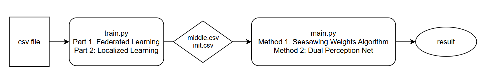

# NSC-Second-Primary-Cancer
國科會大專生計畫

## Introduction
This project aims to solve the problem of data feature integration in cross-institutional learning. We evaluate the performance of our algorithms using secondary primary cancer prediction as a test case.

## Data Feature
https://docs.google.com/spreadsheets/d/1WEj-FkA6rKu-d4bRo4FB25iOFkKjEfrLzX3zZJvTRZs/edit?usp=sharing

## Workflow

## Results
Baseline Model: https://docs.google.com/spreadsheets/d/19rnKfMarwzCMmZh4F_epu-ZGWfWTFW83BQVWSX9STtE/edit?usp=sharing
Compared Model: https://docs.google.com/spreadsheets/d/1s6C-uj0_LLuG1_v8S1Z84jg9uTXr79FzQVwmH3_rHt4/edit?usp=sharing